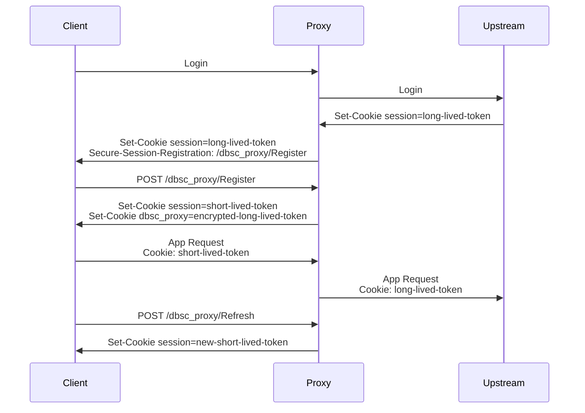

# DBSC Proxy

A stateless proxy that can sit in front of your web app to implement
[Device-Bound Session Credentials](https://www.w3.org/TR/dbsc/).

The proxy adds a DBSC registration header when it sees your app set a session
cookie for a client. Then, it handles the registration and refresh DBSC endpoints.
It transparently replaces your app's long-lived session cookie with a
short-lived device-bound cookie, and then replaces the short-lived cookie
with your app's cookie when it proxies the request upstream to your app.

## How to use it

Probably don't, for now! DBSC is still a W3C draft. It's only available when
you turn on a flag in Chrome, or opt-in to an Origin Trial.
[Learn more about trying the beta implementation of DBSC](https://github.com/w3c/webappsec-dbsc/wiki/Testing-early-versions-of-DBSC).

## How to try it

1. Start up your app. You can also use the example app in `example-upstream`,
  which is a simple Django notes app.

2. Install [go](https://go.dev/). The proxy has been tested with Go 1.25.4.
  You can use [asdf](https://asdf-vm.com/) to install it: `asdf install`.

3. Run the proxy: `DBSC_PROXY_SECRET=sosecret go run cmd/proxy`

## Configuration

Configuration is done via environment variables:

- `DBSC_PROXY_SECRET`: A secret used for signing and encryption. Required.

- `DBSC_PROXY_COOKIE_NAME`: The name of the cookie you want to protect with DBSC.
  Defaults to `session`. This should be the cookie that authenticates user
  session in your app. If your app uses a single session cookie (with signed
  data, or a session ID), you should specify the name of that cookie. If you app
  uses separate cookies for session data and a signature, you should specify the
  name of the signature cookie, since that's the important cookie to protect.

- `DBSC_PROXY_SCOPE`: A JSON-encoded [DBSC Scope](https://w3c.github.io/webappsec-dbsc/#format-session-instructions).
  If this is not provided, the proxy will use `{ "include_site": false }` if the
  upstream's `Set-Cookie` does not specify a domain (i.e., if the cookie
  is origin-scoped rather than being valid for subdomains), and `{ "include_site": true }`
  if the cookie does specify a domain.

- `DBSC_PROXY_REFRESH_INTERVAL`: How long the short-lived DBSC session cookie
  should last before the browser has to refresh it by proving possession of the
  bound session's private key. Defaults to `15m` (15 minutes). This is
  a string in any format supported by Go's [ParseDuration](https://pkg.go.dev/time#ParseDuration).

The proxy will add a `Dbsc-Proxy-Public-Key` header to requests it sends to
the upstream server for clients that have registered a DBSC session and are
using the short-lived, device-bound session cookie. you may want to store or
log this header in your application code. You could also use it to display in
your app which sessions are using DBSC, or block requests without a
`Dbsc-Proxy-Public-Key` header within sessions that previously did have
that header (which could indicate a downgrade attack, or an attacker who
stole the long-lived session cookie during authentication).

## Technical Design

Feedback is welcome on this design! Please open an issue if you have any concerns
or suggestions with the design of the proxy.

### Crypto primitives
- Let `aead(X)` represent the result of `JSON.stringify(X)`, followed by encryption with Nacl's SecretBox (XSalsa20-Poly1305) using the proxy's secret key.

- Let `hmac(Y)` represent a MAC of the string `Y` using Nacl's Auth (HMAC-SHA-512 truncated to 256 bits)

### Session value storage

The DBSC proxy uses 3 persistent values stored by the client:

  - The DBSC session ID is the fixed string "dbsc_proxy"

  - A cookie called `dbsc_proxy_upstream`. This holds the value `aead({ upstream_session, pubkey })` and has an expiration (and all other attributes) equal to the upstream session cookie's. Conceptually, this cookie is serving as the server's storage that a particular keypair is bound to a particular session, but using an authenticated/encrypted cookie to have the client handle persistence instead of the server.

  - The session cookie (with a name matching the upstream application's session cookie, as configured by `DBSC_PROXY_COOKIE_NAME`). This holds the value `dbsc_proxy::timestamp;hmac(timestamp;<dbsc_proxy_upstream cookie value>)`, i.e., a timestamp and a signature of that timestamp together with the value of dbsc_proxy_upstream. It has an expiration of `DBSC_PROXY_REFRESH_INTERVAL`, and otherwise has all the same attributes as the upstream cookie. Conceptually, this cookie is a token that provides a short-lived authorization for the client to make use of the session in the `dbsc_proxy_upstream` cookie without re-proving possession of the private key.

### Session registration

When the proxy returns a response that contains the header `Set-Cookie: session=upstream_session`:
- If the cookie is empty or the expiration is in the past:
  - Pass the `Set-Cookie` as-is to clear the session
  - Also pass a `Set-Cookie` to clear the `dbsc_proxy_upstream` cookie
- If the request did not include a `dbsc_proxy_upstream` cookie, this response is establishing a new session.
  - Add A `Secure-Session-Registration` header with challenge `timestamp;hmac(timestamp)` and path `/dbsc_proxy/StartSession`. We support only the `ES256` algorithm since the public keys are shorter.
  - Leave the `Set-Cookie` as-is to support browsers that doesn't support DBSC

The proxy intercepts requests to the `/dbsc_proxy/StartSession` endpoint, and:

- Checks that the provided challenge matches the format `timestamp;hmac(timestamp)` with a valid HMAC and recent timestamp
- Notes the `session` cookie from the request -- this is the `upstream_session`
- Returns the DBSC JSON session instructions with a fixed session ID of "dbsc_proxy", refresh URL of `/dbsc_proxy/RefreshSession`, credentials of `[{ type: cookie, name: session, attributes: <session cookie attributes>}]`, and a scope from the `DBSC_PROXY_SCOPE` environment variable.
    - Adds a `Set-Cookie: dbsc_proxy_upstream=aead({upstream_session, pubkey})` with the expiration (and all other attributes) from the upstream cookie
    - Adds a `Set-Cookie: session=timestamp;hmac(timestamp;<dbsc_proxy_upstream cookie value>)` header. Sets the expiration of this cookie to `DBSC_PROXY_REFRESH_INTERVAL`, and all other attributes to the values from the upstream cookie.

### Requests In A Session

On all requests, if there is a `session` cookie starting with `dbsc_proxy::` and a `dbsc_proxy_upstream` cookie, the proxy:
  - Verifies that the cookie conforms to the format `timestamp;hmac(timestamp;<dbsc_proxy_upstream>)`
  - Verifies that the HMAC is valid and the timestamp is within 15 minutes
  - Then, decrypts `dbsc_proxy_upstream` to get `({ upstream_session, pubkey })`.
  - When sending the request upstream:
    - Drops the `dbsc_proxy_upstream` cookie
    - Sets the `session` cookie to the upstream value.
    - Adds a `Dbsc-Proxy-Public-Key` header (and removes any client-provided `Dbsc-Proxy-Public-Key` headers) with the public key from the `dbsc_proxy_upstream` cookie.
  - When sending back the response:
    - Adds a `Secure-Session-Challenge` response header, with the value `new_timestamp;hmac(new_timestamp)`.
    - If the response contains the header `Set-Cookie: session=new_upstream_session`, then the app is updating the upstream session value. The proxy adds:
      - `Set-Cookie: dbsc_proxy_upstream=aead({upstream_session: new_upstream_session, pubkey})` with the expiration from the upstream cookie, to update the encrypted long-lived secret
      - `Set-Cookie: session=timestamp;hmac(timestamp;<dbsc_proxy_upstream cookie value>)`, with a timestamp and cookie expiration equal to the request's session cookie timestamp and session cookie expiration. Do NOT update timestamp; use the value from the request -- the client has not provided possession of the private key, so we must not bump the timestamp.

If there is not a session cookie starting with `dbsc_proxy::`, or there is not a `dbsc_proxy_upstream` cookie:
  - Removes any client-provided `dbsc_proxy_upstream` cookies and `Dbsc-Proxy-Public-Key` cookies.

### Refreshing a session

The proxy handles the `/dbsc_proxy/RefreshSession` endpoint to refresh the short-lived session token:

- If `Secure-Session-Response` is not provided, provides the challenge `new_timestamp;hmac(new_timestamp)`
- If a signed challenge is provided:
  - Verifies that the challenge conforms to the format `new_timestamp;hmac(new_timestamp)` with a valid HMAC and recent `new_timestamp` (past 1 minute)
  - Decrypts the `dbsc_proxy_upstream` cookie to get `({ upstream_session, pubkey })`
  - Verifies that the challenge signature matches the decrypted `pubkey`.
  - If all that passes, respond with: `Set-Cookie: session=timestamp;hmac(timestamp;<dbsc_proxy_upstream cookie value>)`. Sets the expiration of this cookie to `DBSC_PROXY_REFRESH_INTERVAL`, and all other attributes to the values from the upstream cookie.
